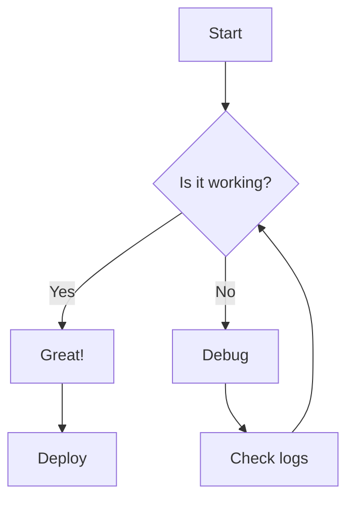
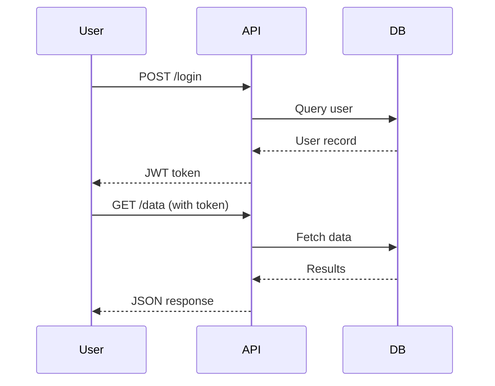
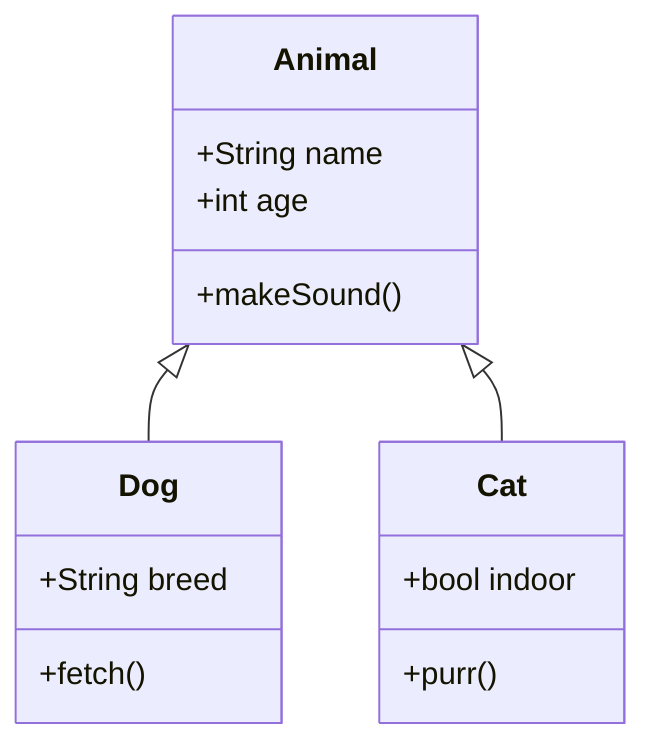
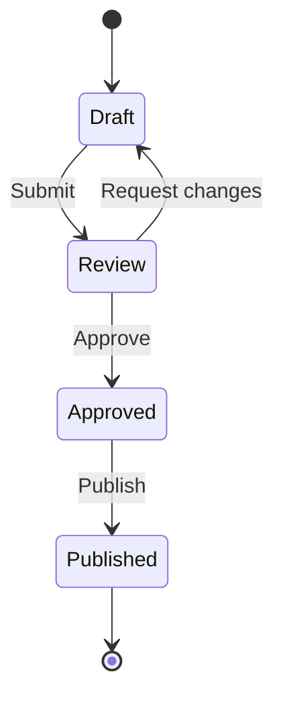
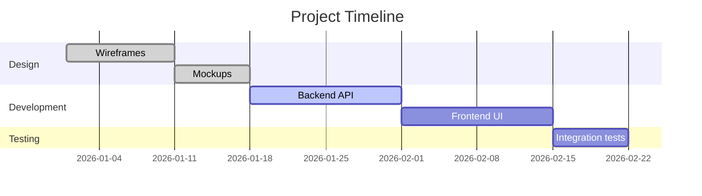
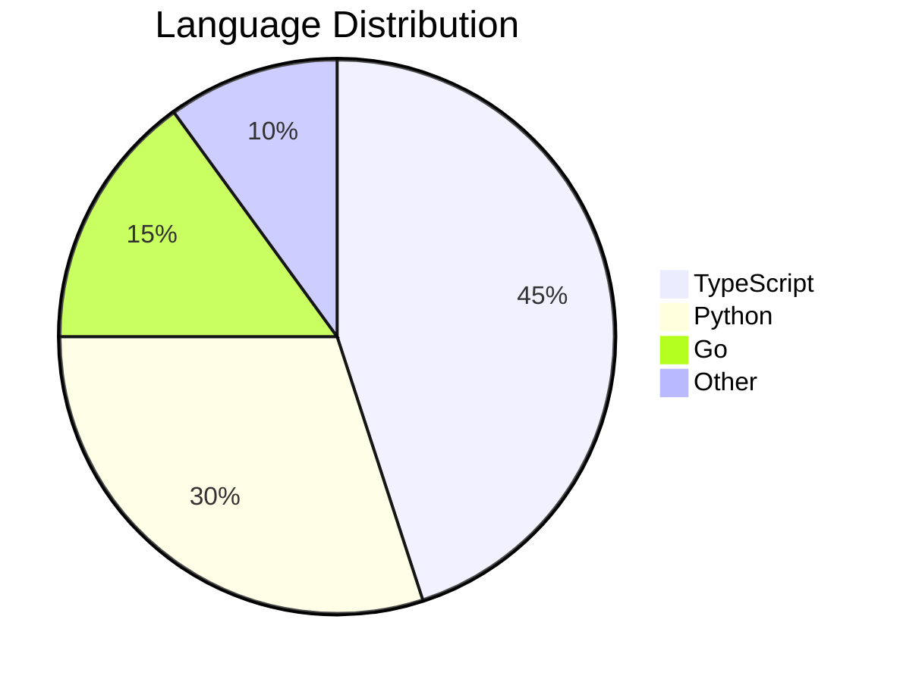
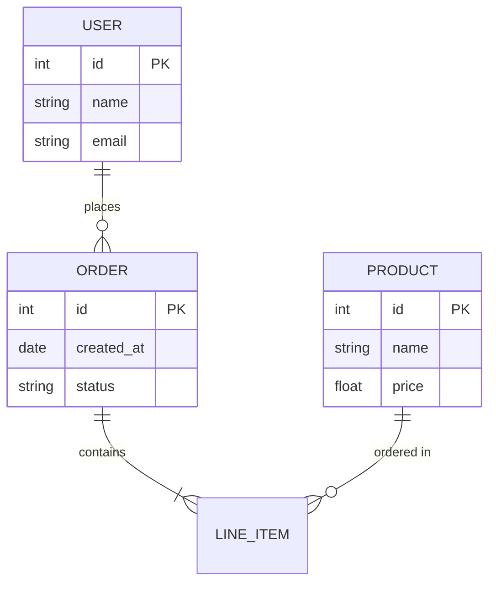

# Mermaid Diagram Examples

A showcase of various Mermaid diagram types rendered to PDF.

## Flowchart

## Sequence Diagram

## Class Diagram

## State Diagram

## Gantt Chart

## Pie Chart

## Entity Relationship Diagram

